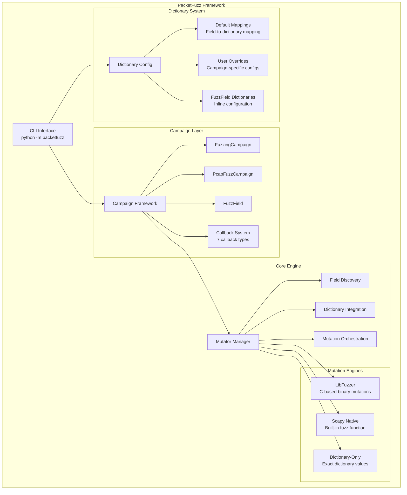

# PacketFuzz - Advanced Network Protocol Fuzzing Framework

The goal of this project is to combine the mutation capabilities of libfuzzer with the predefined protocols and ease of implenting new protocols in scapy. fuzzdb was added to provide a dictionary dataset to be used murring mutation. This project provides a framework that allows the user to very quickly create high quality protocol fuzzers, but also has the flexability to implement custom protocols, and fuzz stategies when needed. The design of this application attempts to replicate some of the user facing configuration ideas present in scapy.

Many of the features and ideas are inspired by boofuzz and similar fuzzers. Once complete this project should have all the features and abilities that boofuzz has with the added advantage of greater flexability and less time to develop a fuzzer by using scapy's extensive protocol definitions.

The structure of this project consistes of 3 main components, a libfuzzer interface for fuzzing individual fields without needing a astandard libfuzz harness, a mutator manager that accepts scapy packets for fuzzing, and a fuzzing framework that allows the suer to define fuzz campaings. For more advanced usage the fuzzer can be used without the campaign framework.

For detailed usage information, please see the [framework documentation](FRAMEWORK_DOCUMENTATION.md).

---

## Architecture Overview



## Project Structure

```
PacketFuzz/
├── examples/                   # Example scripts and campaign configs
│   ├── basic/                  # Basic examples for simple settup
│   ├── advanced/               # Advanced features and patterns
│   └── intermediate/           # Intermediate features
├── tests/                      # Test suite (unit, integration, example validation)
│   └── test_*.py               # Test files for pytest
├── fuzzdb/                     # FuzzDB dictionary database
├── packetfuzz/                 # Main package directory
│   ├── __init__.py            # Package initialization
│   ├── __main__.py            # CLI entry point (python -m packetfuzz)
│   ├── cli.py                 # Command-line interface implementation
│   ├── fuzzing_framework.py   # Core campaign framework
│   ├── pcapfuzz.py            # PCAP-based fuzzing
│   ├── default_mappings.py    # Default field-to-dictionary mappings
│   ├── dictionary_manager.py  # Dictionary management and overrides
│   ├── mutator_manager.py     # Core fuzzing engine and Scapy integration
│   ├── mutators/              # Mutation engine components
│   └── utils/                 # Package utilities
├── doc/                        # Documentation
│   ├── FRAMEWORK_DOCUMENTATION.md  # API and usage documentation
│   └── LAYER_WEIGHT_SCALING.md     # Layer scaling documentation
├── requirements.txt            # Python dependencies
└── setup.py                    # Package setup
```

## Quick Start

1. **Install dependencies:**
Instalation is not necessarily required, the application can be executed from the application source, but the libfuzzer componenets must be built.
   ```bash
   pip install -r requirements.txt
   ```

2. **Run tests:**
   ```bash
   python -m pytest tests/
   ```

3. **Try examples:**
   ```bash
   # Basic examples
   python examples/basic/01_quick_start.py
   python examples/basic/02_campaign_types.py
   
   # Run all examples
   python examples/run_all_examples.py
   ```


---

## Usage

### Command-Line Usage

```text
python -m packetfuzz [OPTIONS] <campaign_config.py>
```

**Arguments:**
- `<campaign_config.py>`: Path to your campaign configuration Python file.

**Common Options:**
- `--list-campaigns`    List all campaigns in the config file and exit
- `--verbose`, `-v`    Enable verbose output
- `--dictionary-config <file.py>` Override dictionary config for all campaigns
- `--enable-pcap`     Enable PCAP output (default filename)
- `--disable-pcap`    Disable PCAP output
- `--pcap-file <file>`  Specify PCAP output file path
- `--enable-network`   Enable network transmission
- `--disable-network`   Disable network transmission
- `--check-components`  Check if required components (libFuzzer, dictionaries) exist
- `--require-libfuzzer`  Require libFuzzer extension to be available
- `--help`        Show help message and exit

**Examples:**
```bash
# List campaigns
python -m packetfuzz examples/basic/01_quick_start.py --list-campaigns

# Execute campaigns
python -m packetfuzz examples/basic/01_quick_start.py

# Use a custom dictionary config
python -m packetfuzz examples/basic/01_quick_start.py --dictionary-config examples/config/user_dictionary_config.py

# Enable PCAP output to a specific file
python -m packetfuzz examples/basic/01_quick_start.py --pcap-file output.pcap

# Validate campaigns without sending packets
python -m packetfuzz examples/basic/01_quick_start.py --disable-network --verbose

# Check component availability
python -m packetfuzz

### Programmatic Usage
```python
from packetfuzz.fuzzing_framework import FuzzingCampaign, FuzzField
from scapy.layers.inet import IP, TCP
from scapy.layers.http import HTTP, HTTPRequest

class MyCampaign(FuzzingCampaign):
    name = "My Test Campaign"
    target = "192.168.1.1"
    packet = IP() / TCP() / HTTP() / HTTPRequest(Path=b"/", Method=b"GET")
    iterations = 100
    output_network = False  # Set to False for validation/no-network

campaign = MyCampaign()
campaign.execute()
```

---


## Quick Reference

### Core Classes

| Class | Purpose | Example Usage |
|-------|---------|---------------|
| `FuzzingCampaign` | Base campaign class | `class MyCampaign(FuzzingCampaign):` |
| `PcapFuzzCampaign` | PCAP-based fuzzing | `class Regression(PcapFuzzCampaign):` |
| `FuzzField` | Field configuration | `TCP(dport=FuzzField(values=[80, 443]))` |
| `CallbackResult` | Callback return values | `return CallbackResult.SUCCESS` |

## Documentation

- `doc/FRAMEWORK_DOCUMENTATION.md` - Complete API documentation  
- `examples/` - Working code examples
- `tests/` - Test suite


## Troubleshooting

### Debug Mode

```bash
# Enable verbose logging
python -m packetfuzz examples/basic/01_quick_start.py --verbose

# Test with minimal iterations
python -c "
from examples.campaign_examples import WebAppFuzzCampaign
campaign = WebAppFuzzCampaign()
campaign.iterations = 1
campaign.verbose = True
"
```
