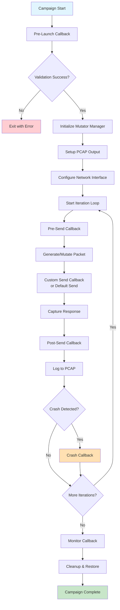
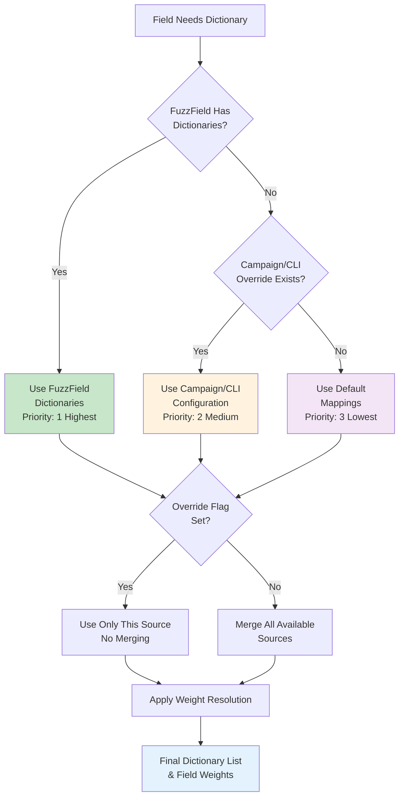
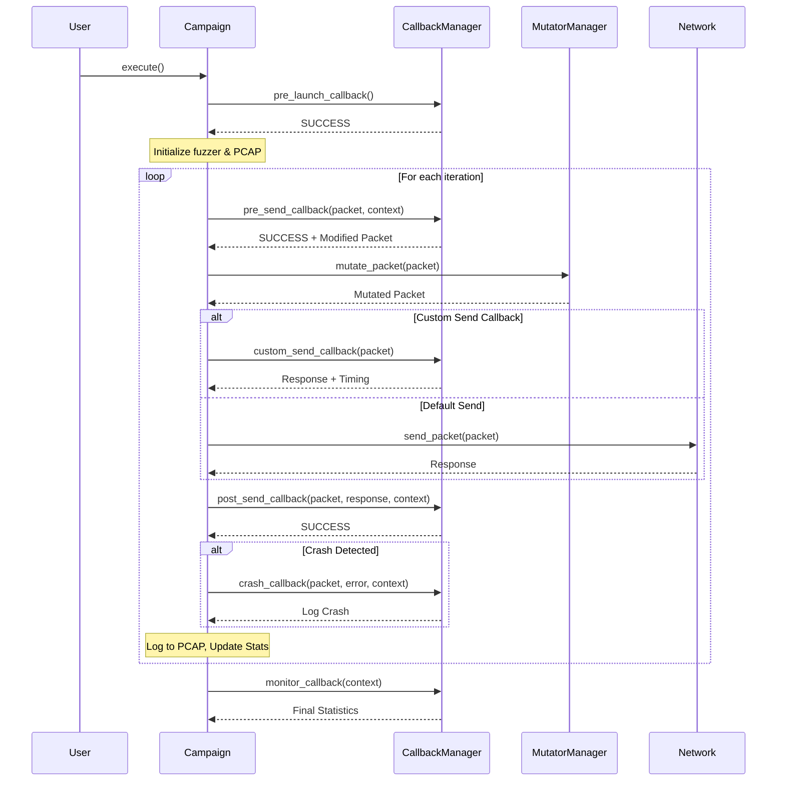
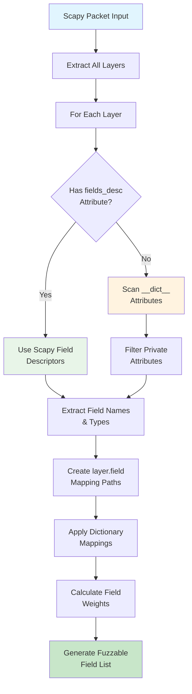

# PacketFuzz Framework Documentation

## Campaign Configuration
Create campaigns using class inheritance with embedded packet configuration. The user adds all campaigns to a `CAMPAIGNS` list, this list is then read when you pass a file with campaigns in it to the CLI.

### Basic Campaign Structure

```python
from packetfuzz.fuzzing_framework import FuzzingCampaign, FuzzField
from scapy.layers.inet import IP, TCP
from scapy.layers.http import HTTP, HTTPRequest

class MyCampaign(FuzzingCampaign):
    name = "My Test Campaign"
    target = "192.168.1.1"
    iterations = 100
    output_pcap = "test.pcap"
    
    packet = (
        IP() /
        TCP() /
        HTTP() /
        HTTPRequest(Path=b"/", Method=b"GET")
    )

# See examples/basic/ for complete working examples
```

### FuzzField Configuration Options

| Parameter | Type | Default | Description | Example |
|-----------|------|---------|-------------|---------|
| `values` | `List[Any]` | `[]` | Static values to cycle through | `[80, 443, 8080]` |
| `dictionaries` | `List[str]` | `[]` | Dictionary file paths | `["fuzzdb/wordlists-misc/common-ports.txt"]` |
| `mutators` | `List[str]` | `["libfuzzer"]` | Mutation methods to use | `["libfuzzer", "scapy"]` |
| `description` | `str` | `""` | Human-readable field description | `"Web server ports"` |

**Examples**: See `examples/basic/03_fuzzfield_options.py` for detailed usage patterns.

### Mutator Types

| Mutator | Description | Use Case | Performance |
|---------|-------------|----------|-------------|
| `"libfuzzer"` | C-based binary mutations | High-performance fuzzing | Very Fast |
| `"scapy"` | Scapy's built-in fuzz() | Protocol-aware mutations | Fast |
| `"dictionary"` | Dictionary-based mutations | Known attack patterns | Medium |
| `"python"` | Pure Python mutations | Fallback when libFuzzer unavailable | Slow |

**Reference**: See `examples/intermediate/02_mutator_comparison.py` for performance benchmarks.

### Fuzzing Modes

| Mode | Description | Use Case | Example |
|------|-------------|----------|---------|
| `"none"` | Replay packets without fuzzing | Regression testing | Validate against known-good traffic |
| `"field"` | Dictionary-based field fuzzing | Protocol fuzzing | HTTP header/payload fuzzing |
| `"binary"` | Binary mutation with libFuzzer | Low-level protocol testing | Custom protocol analysis |
| `"both"` | Combined field + binary fuzzing | Comprehensive testing | Maximum coverage scenarios |

**Complete Examples**: Reference `examples/basic/02_campaign_types.py` for fuzzing mode demonstrations.

**FuzzField Usage Examples**: 
- Basic patterns: `examples/basic/03_fuzzfield_options.py`
- Advanced configurations: `examples/intermediate/01_campaign_inheritance.py`
- Dictionary integration: `examples/config/user_dictionary_config.py`


## PCAP-Based Fuzzing

PCAP-based fuzzing supports layer extraction, payload repackaging, and multiple fuzzing modes for regression testing and real-world traffic analysis. 

**Key Features:**
- Layer extraction and repackaging
- Multiple fuzzing modes (`none`, `field`, `binary`, `both`)
- Automatic payload handling (Scapy parsing with binary fallback)
- Target redirection support

**Implementation**: `packetfuzz.pcapfuzz.PcapFuzzCampaign`
**Examples**: `examples/intermediate/03_pcap_fuzzing.py
```python
class RegressionTest(PcapFuzzCampaign):
    pcap_folder = "regression_samples/"
    fuzz_mode = "none"
    target = "192.168.1.100"
```

#TODO add support for providing a packet structure to package it in
# Extract and fuzz HTTP payloads
```python  
class HttpPayloadFuzz(PcapFuzzCampaign):
    pcap_folder = "regression_samples/"
    extract_layer = "TCP"  # Extract TCP payload  #TODO not implemented yet
    repackage_in = "IP/TCP"  # New headers #TODO replace this with a provided scapy packet to repackage in.
    fuzz_mode = "field" 
    target = "192.168.1.100"
```

## Campaign Execution Flow

The framework follows a structured execution lifecycle with multiple callback points for customization:



**Key Execution Points:**
- **Pre-Launch**: Validation, target checking, setup
- **Per-Iteration**: Packet mutation, sending, response handling
- **Error Handling**: Crash detection and logging
- **Cleanup**: Interface restoration, final reporting

**Implementation**: `packetfuzz.fuzzing_framework.FuzzingCampaign.execute()`
**Examples**: All example campaigns demonstrate the complete execution flow

## Response Tracking System

### FuzzHistoryEntry

The framework automatically tracks sent packets, responses, and timing information using `FuzzHistoryEntry` objects.

**Key Features:**
- Automatic packet/response correlation
- Timing analysis and response time calculation  
- Crash correlation with history entries
- Configurable history size management (default: 1000 entries)

**Implementation**: `packetfuzz.fuzzing_framework.FuzzHistoryEntry`
**Usage Examples**: `examples/advanced/04_response_analysis.py`

## Campaign Execution

### Configuration Attributes

| Category     | Attribute      | Type            | Default           | Description                                      |
|--------------|---------------|-----------------|-------------------|--------------------------------------------------|
| **Required** | `name`        | `str`           | `None`            | Campaign identifier                              |
|              | `target`      | `str`           | `None`            | Target IP address                                |
| **Execution**| `iterations`  | `int`           | `1000`            | Number of packets to send                        |
|              | `duration`    | `Optional[int]` | `None`            | Max execution time (seconds)                     |
|              | `rate_limit`  | `float`         | `10.0`            | Packets per second                               |
| **Output**   | `output_pcap` | `Optional[str]` | `None`            | Output PCAP filename                             |
|              | `append_pcap` | `bool`          | `False`           | Append to existing PCAP or overwrite            |
|              | `verbose`     | `bool`          | `True`            | Enable detailed logging                          |
|              | `interface`   | `str`           | `"eth0"`          | Network interface (Layer 2)                     |
| **Network**  | `socket_type` | `Optional[str]` | `None`            | Socket type: `"l2"`, `"l3"`, `"tcp"`, `"udp"`, `"canbus"`; auto-detect if `None` |
|              | `output_network` | `bool`        | `True`            | Actually send packets                            |
|              | `response_timeout` | `float`     | `2.0`             | Response capture timeout (seconds)               |
|              | `capture_responses` | `bool`     | `False`           | Enable response capture                          |
| **Scaling**  | `layer_weight_scaling` | `Optional[float]` | `None`      | Layer weight scaling factor (0.0-1.0). Lower values = less outer layer fuzzing |
|              | `enable_layer_weight_scaling` | `bool` | `True`        | Enable/disable layer weight scaling             |
| **Advanced** | `crash_packet_logging` | `bool`   | `True`            | Enable crash packet capture                      |
|              | `crash_log_directory` | `str`    | `"crash_logs/"`   | Directory for crash artifacts                    |

### Layer Weight Scaling

Layer weight scaling allows fine-tuned control over mutation distribution across protocol layers:

- **Lower values (0.1)**: Focus mutations on inner layers (payloads), minimize header fuzzing
- **Higher values (0.9)**: Distribute mutations more evenly across all layers  
- **Formula**: `effective_weight = base_weight × (scaling_factor ^ depth_below_surface)`

**Example Usage:**
```python
class WebAppFuzzCampaign(FuzzingCampaign):
    def __init__(self):
        super().__init__()
        self.layer_weight_scaling = 0.1  # Focus on HTTP payload, not IP/TCP headers
        self.enable_layer_weight_scaling = True
        
    def get_packet(self):
        return IP(dst="192.168.1.100") / TCP(dport=80) / Raw("HTTP data")
```

**Documentation**: See `doc/LAYER_WEIGHT_SCALING.md` for comprehensive details and edge cases.
**Examples**: `examples/advanced/02_layer_weight_scaling.py`

## Dictionary Management

### Hierarchy & Resolution

The framework uses a 3-tier hierarchical system for dictionary resolution with sophisticated merging:



**Key Features:**
- Hierarchical merging with override controls
- Field-specific and pattern-based mappings
- Weight resolution for mutation prioritization
- CLI and campaign-level configuration overrides

**Implementation**: `packetfuzz.dictionary_manager.DictionaryManager`
**Configuration**: `packetfuzz.default_mappings`
**Examples**: `examples/config/user_dictionary_config.py`


### Dictionary Sources & Priority

| Priority | Source | Scope | Override Control | Example |
|----------|--------|-------|------------------|---------|
| **1** | FuzzField | Single field | Not applicable | `FuzzField(dictionaries=["custom.txt"])` |
| **2** | Campaign Config | Campaign-wide | `dictionary_override` flag | `dictionary_config_file = "config.py"` |
| **3** | CLI Override | Global | Command-line flag | `--dictionary-config config.py` |
| **4** | Default Mappings | Framework | Built-in rules | Automatic field associations |

- All dictionaries are merged unless `dictionary_override=True` is set for a field in user/campaign/CLI config.
- Inline FuzzField dictionaries always take precedence and are never overridden.

### Configuration Examples

**Default Mappings**: Built-in field-to-dictionary associations in `packetfuzz/default_mappings.py`
**User Configuration**: Campaign and CLI overrides in `examples/config/user_dictionary_config.py`
**CLI Usage**: Global dictionary overrides via `--dictionary-config` flag

**Detailed Examples**: 
- Basic configuration: `examples/basic/04_dictionary_config.py`
- Advanced overrides: `examples/intermediate/05_dictionary_overrides.py`

## Weight & Priority Resolution

The framework uses sophisticated weight resolution for field prioritization and dictionary selection.

### Weight Resolution Priority Table

| Priority | Source | Weight Range | Description |
|----------|--------|--------------|-------------|
| **1 (Highest)** | User-provided in config | 0.0 - 1.0 | Explicit field weights |
| **2** | Advanced field mappings | 0.7 - 0.9 | Property-based rules |
| **3** | Name-based patterns | 0.6 - 0.8 | Field name matching |
| **4** | Type-based defaults | 0.5 - 0.7 | Scapy field type |
| **5 (Lowest)** | Framework default | 0.5 | All unmatched fields |

**Implementation**: `packetfuzz.dictionary_manager.get_field_weight()`
**Examples**: `examples/config/user_dictionary_config.py` for weight configuration patterns


## Network Interface Offload Management

When fuzzing with malformed packets, network interface offload features can interfere by automatically "fixing" corrupted checksums, segmentation, and other intentionally malformed packet attributes before transmission. PacketFuzz provides automatic network interface configuration to disable these features during fuzzing campaigns.

### Campaign Configuration 

**Attributes:**
- `disable_interface_offload: bool = False` - Enable/disable interface offload management
- `interface: str = "eth0"` - Network interface to configure
- `interface_offload_restore: bool = True` - Restore settings when done
- `interface_offload_features: Optional[List[str]] = None` - Specific features to disable

### CLI Usage

```bash
# Enable interface offload management for all campaigns
sudo python -m packetfuzz --disable-offload campaign_config.py

# Root privileges required for interface configuration
sudo python -m packetfuzz --disable-offload examples/malformed_packets.py
```

**Requirements:**
- Root privileges for interface configuration
- `ethtool` command availability
- Valid network interface

**Implementation**: `packetfuzz.utils.interface_manager`
**Examples**: `examples/advanced/03_malformed_packets.py`

### Default Offload Features

When `disable_interface_offload = True`, the following features are disabled by default:

- `tx-checksumming` - Transmit checksum offloading
- `rx-checksumming` - Receive checksum offloading  
- `tcp-segmentation-offload` - TCP segmentation offload (TSO)
- `generic-segmentation-offload` - Generic segmentation offload (GSO)
- `generic-receive-offload` - Generic receive offload (GRO)
- `large-receive-offload` - Large receive offload (LRO)

### Error Handling

The framework uses **hard fail** behavior by default:
- If interface configuration fails, the campaign stops with an error
- Use CLI flags to override campaign settings if needed
- Original interface settings are automatically restored after campaign completion

---


## Advanced Features

### Callback System Architecture

The framework provides 7 callback types for comprehensive monitoring and custom logic integration.

#### Callback Types & Context

| Callback Type | Timing | Context Provided | Return Value | Use Cases |
|---------------|--------|------------------|--------------|-----------|
| `pre_launch_callback` | Before campaign starts | Campaign config | `CallbackResult` | Target validation, setup |
| `pre_send_callback` | Before each packet | Packet, iteration info | `CallbackResult` | Packet modification, logging |
| `custom_send_callback` | Replaces packet send | Packet, response, timing | `CallbackResult` | Custom send implementations |
| `post_send_callback` | After each packet | Packet, response, timing | `CallbackResult` | Response analysis, metrics |
| `crash_callback` | On errors/crashes | Packet, error, context | `CallbackResult` | Error handling, crash logging |
| `no_success_callback` | On callback failures | Packet, error, context | `CallbackResult` | Failure handling |
| `monitor_callback` | Periodic intervals | Progress, statistics | `CallbackResult` | Progress monitoring, alerts |

#### Callback Return Values

| Return Value | Description | Effect |
|--------------|-------------|--------|
| `SUCCESS` | Normal execution | Continue to next step |
| `NO_SUCCESS` | Callback execution failed (non-critical) | Log and continue |
| `FAIL_CRASH` | Target failure detected | Trigger crash callback |

**Implementation**: `packetfuzz.fuzzing_framework.CallbackManager`  
**Return Types**: `packetfuzz.fuzzing_framework.CallbackResult`  
**Examples**: `examples/intermediate/04_callback_basics.py`

#### Callback Execution Sequence



### Field Resolution & Discovery

The framework uses dynamic field discovery to work with any Scapy packet type, including custom protocols.

**Key Features:**
- Automatic field discovery using Scapy's `fields_desc`
- Fallback detection via object introspection
- Custom protocol support
- Layer-based field mapping

**Field Discovery Process:**



**Implementation**: `packetfuzz.mutator_manager.field_discovery()`
**Examples**: `examples/advanced/05_custom_protocols.py`


## Testing

```bash
python -m pytest tests/
```

## API Reference

### FuzzingCampaign Attributes

| Category | Attribute | Type | Default | Description |
|----------|-----------|------|---------|-------------|
| **Basic** | `name` | `Optional[str]` | `None` | Campaign identifier |
| | `target` | `Optional[Any]` | `None` | Target IP address or list |
| | `packet` | `Optional[Packet]` | `None` | Packet template to fuzz |
| | `iterations` | `int` | `1000` | Number of packets to send |
| **Timing** | `rate_limit` | `float` | `10.0` | Packets per second |
| | `duration` | `Optional[int]` | `None` | Max execution time (seconds) |
| | `response_timeout` | `float` | `2.0` | Response capture timeout |
| | `stats_interval` | `float` | `10.0` | Statistics reporting interval |
| **Output** | `output_pcap` | `Optional[str]` | `None` | Output PCAP filename |
| | `append_pcap` | `bool` | `False` | Append to existing PCAP |
| | `verbose` | `bool` | `True` | Enable detailed logging |
| | `output_network` | `bool` | `True` | Actually send packets |
| **Network** | `interface` | `str` | `"eth0"` | Network interface |
| | `socket_type` | `Optional[str]` | `None` | Socket type (`"l2"`, `"l3"`, `"tcp"`, `"udp"`, `"canbus"`) |
| | `capture_responses` | `bool` | `False` | Enable response capture |
| **Scaling** | `layer_weight_scaling` | `Optional[float]` | `None` | Layer weight scaling factor (0.0-1.0) |
| | `enable_layer_weight_scaling` | `bool` | `True` | Enable layer weight scaling |
| | `excluded_layers` | `Optional[List[str]]` | `None` | Layer names to exclude from fuzzing |
| | `fuzz_start_layer` | `Optional[str]` | `None` | Layer to attach PacketFuzzConfig to |
| **Mutators** | `mutator_preference` | `Optional[List[str]]` | `["libfuzzer"]` | Preferred mutators |
| **Dictionaries** | `global_dict_config_path` | `Optional[str]` | `None` | Global dictionary config file |
| | `user_mapping_file` | `Optional[str]` | `None` | User mapping file path |
| | `mapping_merge_mode` | `str` | `"merge"` | Mapping merge mode (`"merge"` or `"override"`) |
| | `advanced_field_mapping_overrides` | `Optional[List[dict]]` | `None` | Inline campaign overrides |
| **Crash Handling** | `crash_packet_logging` | `bool` | `True` | Enable crash packet capture |
| | `crash_log_directory` | `str` | `"crash_logs/"` | Directory for crash artifacts |
| | `crash_log_format` | `str` | `"both"` | Log format (`"scapy"`, `"binary"`, `"both"`) |
| **Interface Offload** | `disable_interface_offload` | `bool` | `False` | Disable network offload features |
| | `interface_offload_features` | `Optional[List[str]]` | `None` | Specific features to disable |
| | `interface_offload_restore` | `bool` | `True` | Restore original settings |
| **Serialization** | `pcap_serialize_failure_mode` | `str` | `"fail"` | Behavior on serialization failure (`"fail"` or `"skip"`) |
| **Callbacks** | `pre_launch_callback` | `Optional[Callable]` | `None` | Pre-launch callback function |
| | `pre_send_callback` | `Optional[Callable]` | `None` | Pre-send callback function |
| | `post_send_callback` | `Optional[Callable]` | `None` | Post-send callback function |
| | `crash_callback` | `Optional[Callable]` | `None` | Crash callback function |
| | `no_success_callback` | `Optional[Callable]` | `None` | No-success callback function |
| | `monitor_callback` | `Optional[Callable]` | `None` | Monitor callback function |
| | `custom_send_callback` | `Optional[Callable]` | `None` | Custom send callback function |

### FuzzField Parameters

| Parameter | Type | Default | Description |
|-----------|------|---------|-------------|
| `values` | `List[Any]` | `[]` | Static values to cycle through |
| `dictionaries` | `List[str]` | `[]` | Dictionary file paths |
| `mutators` | `List[str]` | `["libfuzzer"]` | Mutation methods |
| `description` | `str` | `""` | Field description |

### Core Methods

| Method | Return Type | Description |
|--------|-------------|-------------|
| `campaign.execute()` | `bool` | Run the campaign |
| `campaign.validate_campaign()` | `bool` | Validate campaign configuration |
| `campaign.create_fuzzer(mutator_preference)` | `MutatorManager` | Create fuzzer instance with optional mutator preference |
| `campaign.get_packet_with_embedded_config()` | `Optional[Packet]` | Get configured packet with embedded FuzzField configs |

## Example Code Reference

The following table shows where to find complete working examples for each feature:

| Feature Category | Feature | Example File | Description |
|------------------|---------|--------------|-------------|
| **Basic Usage** | Quick Start | `examples/basic/01_quick_start.py` | Simple campaign setup and execution |
| | Campaign Types | `examples/basic/02_campaign_types.py` | Different campaign configurations |
| | FuzzField Basics | `examples/basic/02_fuzzfield_basics.py` | Field-level configuration examples |
| | PCAP Basics | `examples/basic/03_pcap_basics.py` | Basic PCAP output and analysis |
| **Intermediate** | Campaign Inheritance | `examples/intermediate/01_campaign_inheritance.py` | Creating campaign hierarchies |
| | Dictionary Configuration | `examples/intermediate/02_dictionary_config.py` | Advanced dictionary management |
| | PCAP Regression Testing | `examples/intermediate/03_pcap_regression.py` | PCAP-based fuzzing and regression |
| | Callback System | `examples/intermediate/04_callback_basics.py` | Implementing campaign callbacks |
| **Advanced** | Complex Campaigns | `examples/advanced/01_complex_campaigns.py` | Multi-layer, multi-target campaigns |
| | PCAP Analysis | `examples/advanced/02_pcap_analysis.py` | Advanced PCAP processing and layer extraction |
| **Configuration** | Dictionary Configs | `examples/config/` | User dictionary and mapping configurations |
| **Utilities** | Run All Examples | `examples/run_all_examples.py` | Script to execute all example campaigns |


